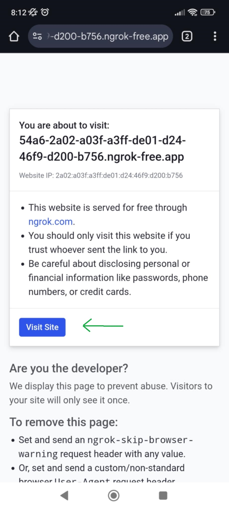
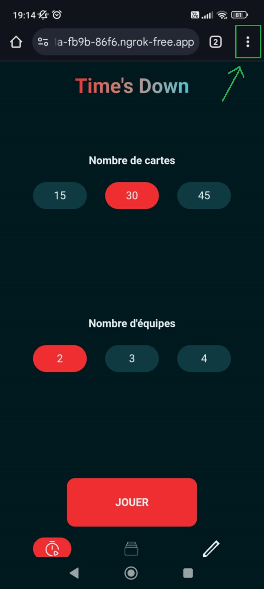
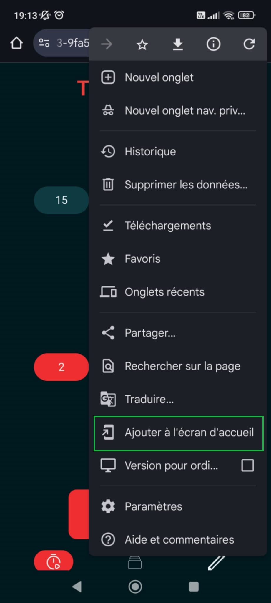
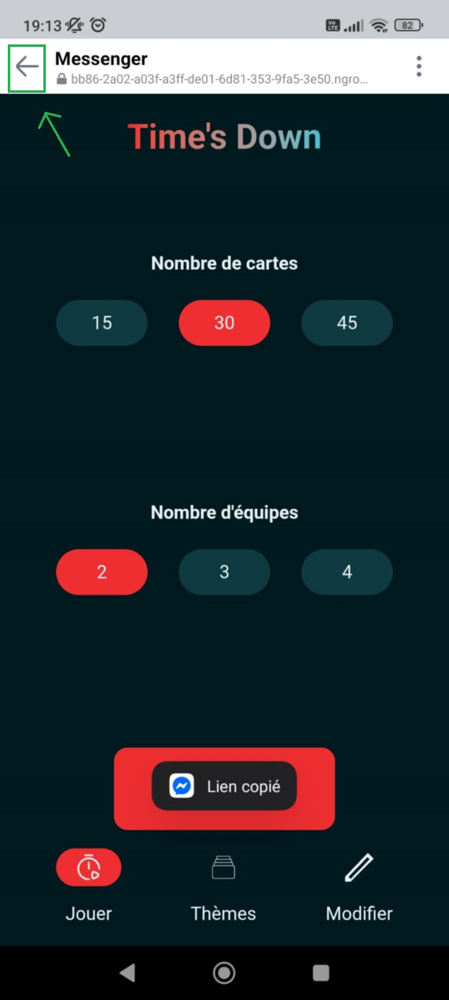
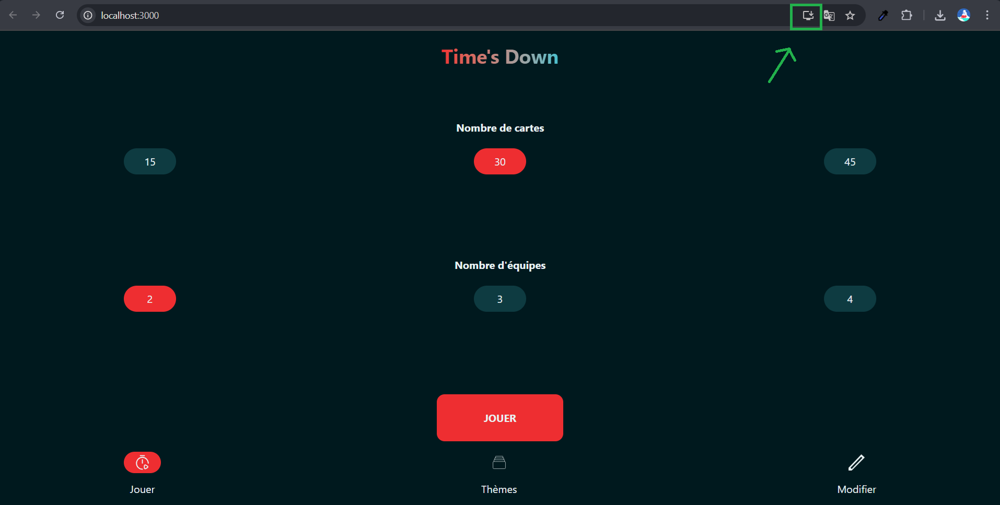

# TimesDown

This project is a PWA that implements the game **Time's Up** in French.

  
  
  
  

## PWA Installation Guide

This application is built as a **Progressive Web App (PWA)**, which means you can install it directly onto your device, whether it's a phone or a computer. For development and testing purposes, the most straightforward installation method involves using **ngrok** and the **`serve` npm package**.

Here's how to install the PWA:

1.  **Download ngrok:** Visit the [ngrok website](https://ngrok.com/) and follow their instructions to install it on your system.
2.  **Install the `serve` package:** Open your command line or terminal and run `npm install -g serve`. The `-g` stands for "global," allowing you to use `serve` from any directory.
3.  **Start the local server:** Navigate to the root folder of this project in your terminal. Then, run `npm run serve`. This command will start a local web server for the application.
4.  **Expose your app online with ngrok:** In your terminal, run `ngrok http <port_number>`. Replace `<port_number>` with the port number that the `npm run serve` command indicated (e.g., 3000, 5000). Ngrok will provide a temporary public URL for your application.

Finally, open the URL provided by ngrok in your web browser. While viewing the application, go into your browser's settings or menu (often represented by three dots or lines) and look for an option like "Add to Home Screen," "Install app," or "Download app" to install the PWA.

### Phone

  
  
  

#### ⚠️ Known install issue ⚠️

If your browser only offers to create a shortcut instead of prompting to install the PWA, ensure you have only one browser tab open with the ngrok link. Some in-app browsers, like the one in Facebook Messenger, might prevent proper PWA installation. If you opened the link this way, close that browser and open the ngrok link directly in your main browser (e.g., Chrome).

### Computer

## Version History

For a detailed list of changes in each version, please refer to the [CHANGELOG.md](CHANGELOG.md) file.

## License

This project is licensed under the [GNU Lesser General Public License v3.0](https://www.gnu.org/licenses/lgpl-3.0.html).
