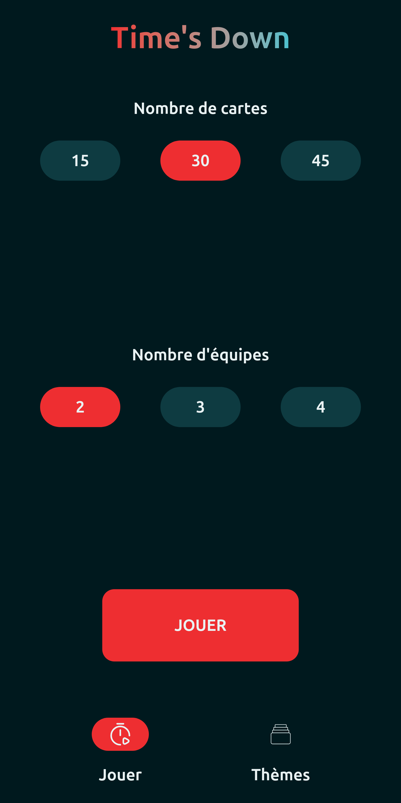
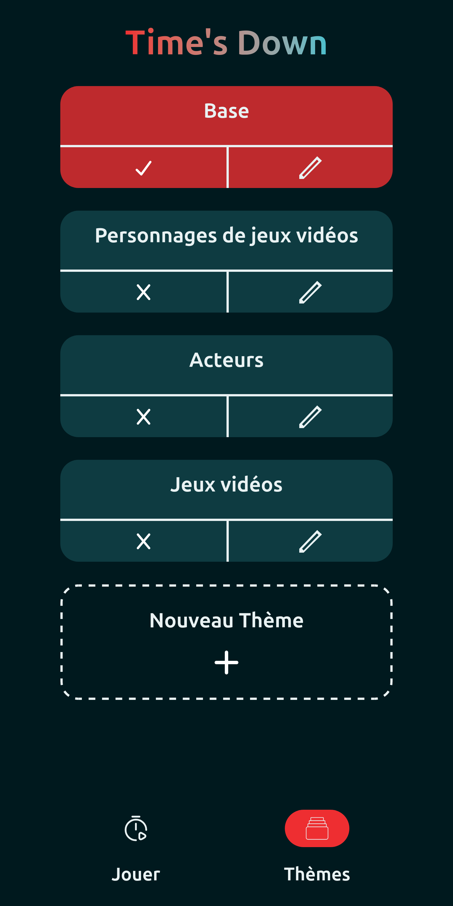
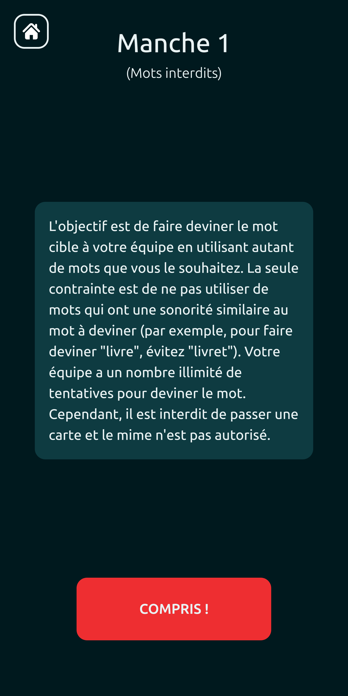
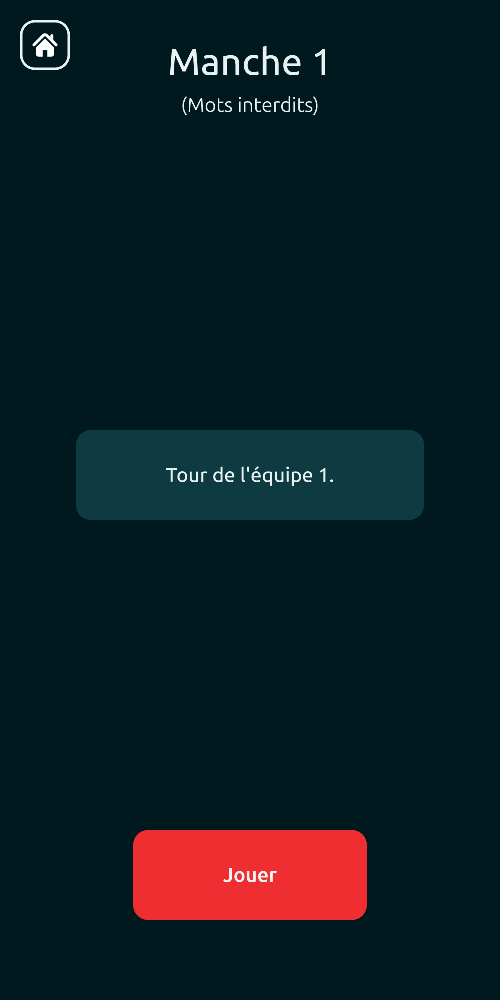
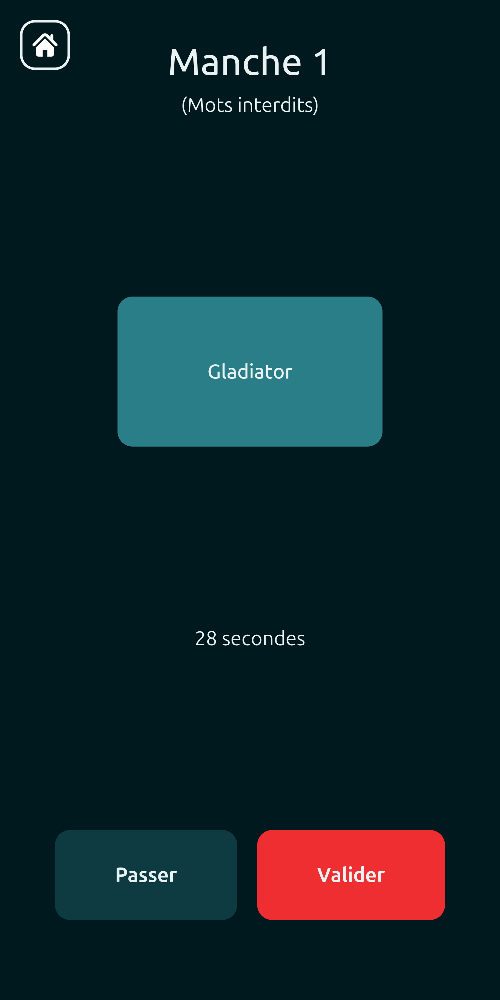

# TimesDown

[](https://www.gnu.org/licenses/gpl-3.0)

This project is a PWA that implements the game **Time's Up** in French.

<div style="overflow-x: auto; white-space: nowrap;">
  
  
  
  
  
</div>

## 📱 Installing as a PWA (Mobile)

To get the full "app" experience on your phone, you need to access the site over HTTPS. A great way to do this easily and for free is using **ngrok**.

### Mobile Access via ngrok

1. **Install ngrok**: If you haven't already, [install ngrok](https://ngrok.com/download).
2. **Build and preview**:
   ```bash
   npm run build
   npm run preview
   ```
3. **Expose your local server**:
   While your local preview server is running (by default on port 4173), run:
   ```bash
   ngrok http 4173
   ```
4. **Access on your phone**:
   Open the HTTPS URL provided by ngrok (e.g., `https://xxxx-xxxx.ngrok-free.app`) on your mobile browser (Safari on iOS, Chrome on Android).

   _Tip: you can create a QR code from a website to fasten the connection to the random url on your mobile._

5. **Install**:
   - **iOS**: Tap the "Share" button and select **"Add to Home Screen"**.
   - **Android**: Tap the three dots menu and select **"Install App"** or **"Add to Home Screen"**.
     If your phone does not prompt you to "install" but tries to make a simple shortcut to your home screen, refresh the page and try again.

#### ⚠️ Known install issue ⚠️

If your browser does not show you the install instructions and only prompts you to add a shortcut to home screen, you can try the following:

- Close all other tabs containing a link to ngrok
- Refresh the page and retry multiple times (for some reason, this might work after x attempts 🤷‍♂️)

## Version History

For a detailed list of changes in each version, please refer to the [CHANGELOG.md](CHANGELOG.md) file.

## License

This project is licensed under the [GNU General Public License v3.0](https://www.gnu.org/licenses/gpl-3.0.html).
