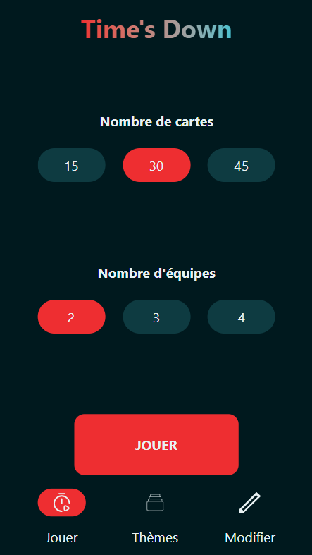
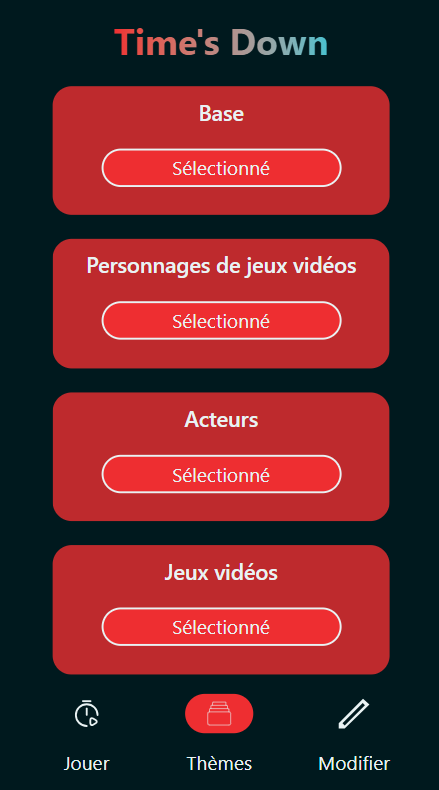
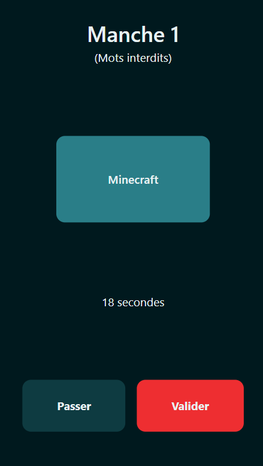
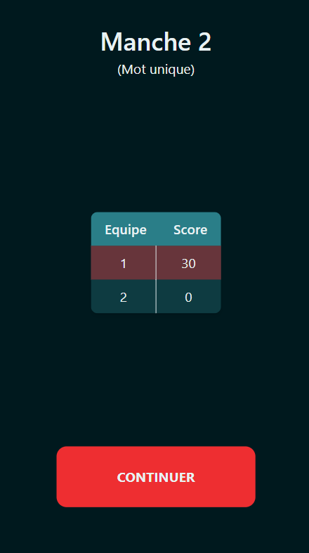

# TimesDown

This project is a PWA that implements the game **Time's Up**.

  
  
  
  

## Installation

As a PWA, this application can be installed on your phone. The most simple way to do this is to use [ngrok](https://ngrok.com/) along with the "serve" npm package.

Install ngrok from their website and install the "serve" package from npm with `npm install -g serve` (the g flag is there to install this package globally). Then, simply run `npm run serve` in the root of this project to start serving the app on your network and finally run `ngrok http <port_number>` to make your app available online.

Then you can access the app on the url given by ngrok. While on the app's page, you can go to the settings of your browser and look for some menu like "add to home screen".

## Version History

For a detailed list of changes in each version, please refer to the [CHANGELOG.md](CHANGELOG.md) file.

## License

This project is licensed under the [GNU Lesser General Public License v3.0](https://www.gnu.org/licenses/lgpl-3.0.html).
